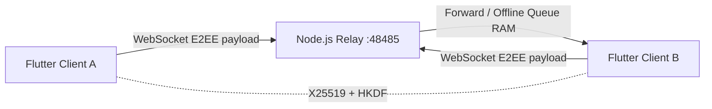

# Cấu trúc hệ thống Lan Secure Messenger

## 1. Tổng quan

Lan Secure Messenger gồm hai phần:

1. **Flutter Client**: chạy trên macOS, Windows, Android, iOS và Web. Client tạo khóa, mã hóa/giải mã tin nhắn, lưu dữ liệu cục bộ và hiển thị giao diện.
2. **Local Relay Server**: Node.js dùng thư viện `ws`. Server chỉ giữ kết nối WebSocket, chuyển tiếp payload và queue tạm tin nhắn khi người nhận offline.

Relay không có Private Key hoặc Session Key nên không thể đọc plaintext.



## 2. Cây thư mục chính

```text
lan_secure_messenger/
├── android/                    # Cấu hình Android và quyền mạng/camera
├── ios/                        # Cấu hình iOS và quyền camera/LAN
├── macos/                      # Sandbox entitlements macOS
├── windows/                    # Runner Windows
├── web/                        # Flutter Web bootstrap
├── lib/
│   ├── main.dart               # Bootstrap profile, unlock và app shell
│   ├── models/
│   │   ├── contact_model.dart  # ContactModel và map serialization
│   │   └── message_model.dart  # MessageModel và map serialization
│   ├── core/
│   │   ├── crypto/
│   │   │   └── crypto_service.dart
│   │   ├── database/
│   │   │   ├── database_helper.dart
│   │   │   ├── database_backend.dart
│   │   │   ├── database_backend_io.dart
│   │   │   ├── database_backend_web.dart
│   │   │   └── database_backend_stub.dart
│   │   ├── network/
│   │   │   └── websocket_client.dart
│   │   └── services/
│   │       ├── chat_contracts.dart
│   │       └── chat_service.dart
│   └── ui/
│       └── screens/
│           ├── setup_profile_screen.dart
│           ├── server_connect_screen.dart
│           ├── qr_contact_screen.dart
│           ├── chat_list_screen.dart
│           └── chat_room_screen.dart
├── server/
│   ├── index.js               # WebSocket relay engine
│   ├── package.json           # Dependency ws và npm start
│   └── package-lock.json
├── test/                      # Crypto, database, pipeline và widget tests
├── PROJECT_SPEC.md
├── README.md
└── pubspec.yaml
```

## 3. Luồng khởi động client

1. `main.dart` khởi tạo `DatabaseHelper`.
2. Nếu chưa có dòng `my_profile`, app mở `SetupProfileScreen`.
3. Người dùng nhập tên và Master PIN 6 chữ số.
4. `CryptoService` tạo X25519 key pair.
5. Private Key được mã hóa bằng PBKDF2-HMAC-SHA256 + AES-256-GCM.
6. Profile được lưu cục bộ; payload Private Key mã hóa chứa ciphertext, IV và tag.
7. Nếu profile đã tồn tại, app yêu cầu Master PIN để giải mã Private Key vào RAM.
8. Sau khi unlock, `WebSocketClient` tự kết nối tới URL relay đã lưu, mặc định `ws://localhost:48485`.
9. `ChatService` dùng chung profile, Private Key, Database và WebSocket transport.

## 4. Luồng gửi tin nhắn

```text
ChatRoomScreen
    -> ChatService.sendMessage()
    -> DatabaseHelper tìm ContactModel
    -> CryptoService derive X25519 + HKDF Session Key
    -> AES-256-GCM encrypt plaintext
    -> WebSocketClient gửi MESSAGE_FORWARD
    -> DatabaseHelper lưu plaintext cục bộ với status = sent
    -> messageStream cập nhật UI
```

Payload gửi qua relay:

```json
{
  "type": "MESSAGE_FORWARD",
  "to": "usr_receiver",
  "from": "usr_sender",
  "payload": {
    "iv": "base64",
    "ciphertext": "base64",
    "tag": "base64"
  }
}
```

## 5. Luồng nhận tin nhắn

```text
WebSocketClient.messages
    -> ChatService.onMessageReceived()
    -> Tìm Public Key người gửi trong contacts
    -> Dẫn xuất Session Key
    -> AES-256-GCM decrypt
    -> Lưu plaintext vào messages với status = delivered
    -> Phát MessageModel qua messageStream
    -> ChatRoomScreen cập nhật bong bóng
```

Relay chỉ đọc `type`, `to`, `from` và chuyển nguyên `payload`. Relay không giải mã `ciphertext`.

## 6. Database

### Native

Android, iOS, macOS và Windows dùng SQLite qua `sqflite_common_ffi`. `DatabaseHelper` gọi `path_provider` để chọn thư mục lưu database. Test VM có fallback vào thư mục tạm nếu plugin native chưa được đăng ký.

### Web

Web dùng backend fallback in-memory để không import `dart:io` và không làm trình duyệt crash. Khi cần persistence Web production, thay backend này bằng IndexedDB hoặc SharedPreferences Web.

### Bảng

- `contacts`: ID, tên hiển thị, Public Key, trạng thái online, last seen.
- `messages`: sender, receiver, plaintext đã giải mã, timestamp và status.
- `my_profile`: profile hiện tại, Public Key, Private Key đã mã hóa và salt.

## 7. Relay Server

`server/index.js` lắng nghe `0.0.0.0:48485` để client localhost và thiết bị trong LAN/VPS cùng kết nối.

Server quản lý:

- `Map<clientId, WebSocket>` cho client online.
- `Map<clientId, Array>` cho offline queue trong RAM.
- `REGISTER` để đăng ký client ID.
- `MESSAGE_FORWARD` để forward payload.
- Origin allowlist mặc định cho `localhost` và `127.0.0.1`.
- Log connect, disconnect, sender, receiver, kích thước payload và tên field mã hóa.

Server không lưu database tin nhắn và không lưu khóa.

## 8. Quy tắc bảo mật

- Không commit Master PIN, Private Key, file `.env` hoặc dữ liệu người dùng.
- Không log plaintext, ciphertext, IV hoặc authentication tag.
- Chỉ expose cổng WebSocket cần thiết trên VPS.
- Dùng HTTPS/WSS qua reverse proxy khi triển khai production.
- Với relay Internet, nên bổ sung authentication/rate limit trước khi dùng thực tế.
