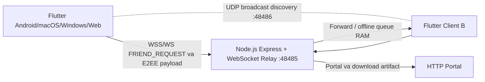

# Lan Secure Messenger v2.0.0

## 1. Tong quan kien truc

Lan Secure Messenger la ung dung Flutter da nen ket hop mo hinh client-server voi kha nang discovery P2P trong LAN:

- **Flutter Client** chay tren Android, macOS, Windows va Web. Client quan ly profile, khoa, database cuc bo, ma hoa/giai ma va giao dien.
- **P2P LAN discovery** dung UDP broadcast tren cong `48486` de phat hien thiet bi trong cung mang. Beacon chi chua user ID, ten hien thi, public key va relay port. Web khong duoc phep mo UDP raw socket nen dung fallback thong bao va QR/Public Key.
- **Node.js Relay Server** dung Express, `ws` va `compression`, lang nghe cong `48485`. Relay phuc vu portal/download artifact qua HTTP, chuyen tiep WebSocket payload va queue tam tin nhan offline trong RAM.
- Lenh ket ban LAN sau khi phat hien peer hien tai di qua `FRIEND_REQUEST` tren WebSocket relay; UDP khong chuyen plaintext tin nhan.



Relay khong co private key, session key hoac plaintext tin nhan.

## 2. Bao mat va ma hoa E2EE

### Khoa va phien

- `CryptoService` tao key pair **X25519**.
- Hai client dung X25519 de tao shared secret, sau do dung HKDF-SHA256 voi context `lan-secure-messenger-session-key` de dan xuat session key.
- Tin nhan duoc ma hoa bang **AES-256-GCM** voi nonce rieng va authentication tag. Relay chi thay cac truong ma hoa `iv`, `ciphertext`, `tag`.
- Public key hien duoc serialize Base64. Relay co the dung public key da dang ky de phan giai loi moi ket ban theo public key.
- Kien truc co the mo rong them **Ed25519** de ky/xac thuc beacon va friend request. Phien ban code hien tai chua thuc hien Ed25519 signature; X25519 public key khong duoc goi la chu ky Ed25519.

### Bao quan khoa va du lieu

- Private key khong duoc luu plaintext. Private key duoc bao boc bang PBKDF2-HMAC-SHA256 tu Master PIN va AES-256-GCM truoc khi luu trong profile cuc bo.
- Native (Android, macOS, Windows) dung SQLite qua `DatabaseHelper` va `StorageService`. Nguoi dung co the chon thu muc luu data tren desktop/Android neu platform cho phep.
- Web dung Cookie va `localStorage` thong qua `StorageService`; database web hien tai dung backend in-memory dong bo cung cac gia tri web storage.
- Khong commit Master PIN, private key, session key hoac du lieu nguoi dung.

## 3. Ba co che ket ban

### 3.1 LAN Auto-Discovery

`LanDiscovery` trong `lib/core/network/lan_discovery_io.dart` bind UDP IPv4 tren cong `48486`, bat broadcast va phat beacon moi 2 giay toi `255.255.255.255`.

Beacon co dang:

```json
{
  "magic": "LAN_SECURE_DISCOVERY",
  "userId": "MY_USER_ID",
  "displayName": "MY_NAME",
  "publicKey": "MY_PUBLIC_KEY",
  "port": 48485
}
```

Beacon cua chinh minh bi bo qua. Peer hop le duoc hien thi trong tab LAN; nut **Ket ban** goi `ChatService.sendContactInvite` va gui `FRIEND_REQUEST` qua relay. Web dung `lan_discovery_stub.dart` va hien thi huong dan dung QR/Public Key.

### 3.2 QR Code

- `qr_flutter` hien thi ma QR ca nhan.
- Payload QR JSON gom `app`, `id`, `name`, `key`; client cung chap nhan payload legacy co truong `pk`.
- `mobile_scanner` quet QR tren thiet bi co camera.
- Desktop/Web co the dan chuoi JSON/Base64 vao o fallback khi camera khong kha dung.
- Sau khi parse, client hien thi dialog thong tin peer truoc khi gui loi moi.

### 3.3 Public Key / User ID thu cong

Tab **ID / Public Key** nhan User ID hoac public key Base64/Hex. User ID duoc gui truc tiep toi relay. Public key duoc relay map ve user ID da dang ky qua truong `targetPublicKey`, sau do chuyen tiep `FRIEND_REQUEST`.

## 4. Xoa tro chuyen hai chieu

Trong `ChatRoomScreen`, nguoi dung co hai lua chon:

- **Xoa mot chieu**: `ChatService.deleteChat(forBoth: false)` chi xoa messages tren database cuc bo.
- **Xoa hai chieu**: `ChatService.deleteChat(forBoth: true)` xoa local va gui `DELETE_CHAT_SYNC` toi peer. Peer nhan `REMOTE_CHAT_DELETED` va xoa chat local.

`forBoth` la co che noi bo tuong ung voi y nghia `delete_for_both: true`; wire protocol hien tai dung cac truong `fromUserId`, `targetUserId`, `chatId`, `timestamp` trong message `DELETE_CHAT_SYNC`.

## 5. Cay thu muc chi tiet

```text
lan_secure_messenger/
├── .github/
│   └── workflows/
│       └── release.yml                 # Build Android/Web, macOS, Windows va publish tag v*
├── android/                            # Android Gradle, manifest, quyen Internet/camera
├── ios/                                # iOS runner va camera/LAN configuration
├── macos/                              # macOS runner, entitlements va Xcode project
├── windows/                            # Windows runner va Inno Setup installer.iss
├── web/                                # Flutter Web bootstrap, manifest va icons
├── lib/
│   ├── main.dart                       # Bootstrap profile, unlock va app shell
│   ├── models/
│   │   ├── contact_model.dart          # ContactModel va contact status
│   │   ├── contact_request_model.dart  # Friend request serialization
│   │   └── message_model.dart          # Message serialization
│   ├── core/
│   │   ├── crypto/
│   │   │   └── crypto_service.dart     # X25519, HKDF, PBKDF2, AES-256-GCM
│   │   ├── database/
│   │   │   ├── database_helper.dart    # Database facade
│   │   │   ├── database_backend.dart  # Backend conditional export
│   │   │   ├── database_backend_io.dart
│   │   │   ├── database_backend_web.dart
│   │   │   └── database_backend_stub.dart
│   │   ├── network/
│   │   │   ├── websocket_client.dart   # Relay connection, reconnect, friend/chat sync
│   │   │   ├── lan_discovery.dart      # Conditional LAN discovery export
│   │   │   ├── lan_discovery_io.dart   # Native UDP broadcast/listener
│   │   │   └── lan_discovery_stub.dart # Web-safe no-op implementation
│   │   └── services/
│   │       ├── chat_contracts.dart     # Transport/database interfaces
│   │       └── chat_service.dart       # Chat, contact request va delete orchestration
│   ├── services/
│   │   └── storage_service.dart        # Native folder picker, Cookie/localStorage Web
│   └── ui/
│       ├── dialogs/
│       │   └── delete_chat_dialog.dart # Xoa mot chieu/hai chieu prompt
│       ├── screens/
│       │   ├── setup_profile_screen.dart
│       │   ├── server_connect_screen.dart
│       │   ├── qr_contact_screen.dart  # QR, LAN va ID/Public Key tabs
│       │   ├── chat_list_screen.dart
│       │   └── chat_room_screen.dart
│       └── widgets/
│           └── data_storage_setting_tile.dart
├── server/
│   ├── index.js                        # Express portal + WebSocket relay :48485
│   ├── package.json                     # ws, express, compression
│   └── public/                          # Portal Web va downloads artifact
├── scripts/
│   └── prepare_portal.sh                # Dong goi/copy Web artifact vao portal
├── test/                               # Crypto, database, pipeline va widget tests
├── pubspec.yaml                         # Flutter dependencies va version 2.0.0+1
├── PROJECT_SPEC.md                      # Product/technical specification
├── README.md                            # Huong dan setup, test va deploy
└── SYSTEM_STRUCTURE.md                  # Tai lieu kien truc nay
```

## 6. Release artifact

Workflow `.github/workflows/release.yml` chi chay khi push tag `v*` va tao bốn artifact:

- `lan-secure-messenger-android.apk`
- `lan-secure-messenger-macos.dmg`
- `lan-secure-messenger-windows-setup.exe`
- `lan-secure-messenger-web.zip`

Job `publish` download artifact tu Android/Web, macOS va Windows, sau do dang len GitHub Release bang `softprops/action-gh-release@v2`.
